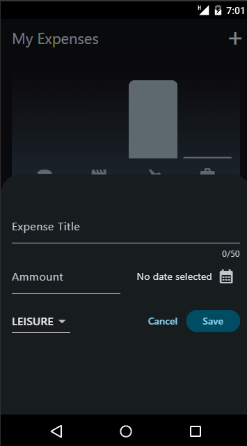
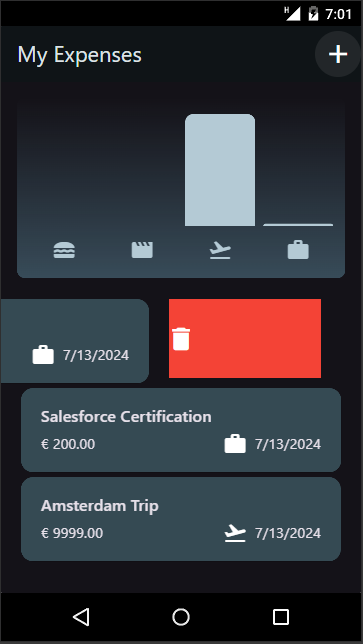
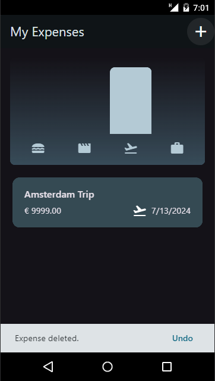
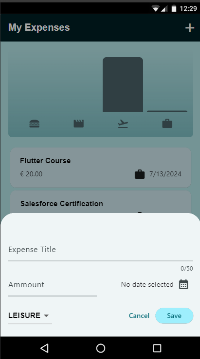

# Expense Tracker Application

  
  
  
  

## Key Concepts Learned

### User Interface Elements

- **Snackbar and Modal Bottom Sheet**
  - How to display transient messages and interactive bottom sheets.

- **Dialogs**
  - Display dialogs using the context object to carry widget meta-information.

### User Input Handling

- **Text Fields and Dropdown Buttons**
  - Handling user input through various input widgets.

- **Date Picker**
  - Building a manual date picker using the `showDatePicker` function.

- **TextEditingControllers**
  - Managing text input with controllers and disposing of them properly to free up memory.

### New Widgets

- **IconButton and AppBar**
  - Utilized in the application to provide interactivity and structure.

- **ListView and ListView.builder**
  - Creating high-performance lists of unknown length.

- **Dismissible Widget**
  - Making list items dismissible for better user experience.

### State and Data Management

- **Passing Function Pointers**
  - Enabling child widgets to call parent widget functions, enhancing inter-widget communication.

- **Managing Input Values**
  - Manually storing input values for better control over form data.

### Theming

- **Color Themes**
  - Defining and using different color themes for light and dark modes.
  - Overwriting specific theme settings to customize the appearance of the app.
 
  - ### Responsive User Interfaces
- **MediaQuery**: Utilized to retrieve the width or height of the screen where the UI is presented. This allows for dynamic adjustments based on screen size.
- **LayoutBuilder**: Used to obtain information about the constraints applied by the parent widget, enabling conditional rendering of UI components.

### Conditional UI Rendering
- By using data from MediaQuery and LayoutBuilder, the UI can adapt its structure, such as rendering a row instead of a column or vice versa, based on the available space.

### Dynamic Padding and Scrollability
- **Dynamic Padding**: Ensures that the content adjusts appropriately when the keyboard is opened, preventing overlap and maintaining accessibility of input fields.
- **Scrollability**: Adding scroll functionality ensures that all input fields remain reachable, regardless of the keyboard's position.

### Safe Area Concept
- **SafeArea**: Utilized to prevent the device camera or other intrusions from overlapping with the UI, ensuring that important UI components are always visible.

### Platform Awareness
- **Platform-Specific Code**: Learned how to detect the platform the app is running on and execute different code or display different widgets based on that information, enhancing cross-platform compatibility.

### Practical Application

- **Context Object**
  - Understanding the importance of the context object in relation to widget positioning and meta-information.
